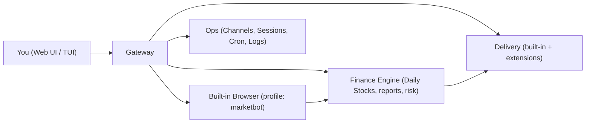

<p align="center">
  
</p>

# MarketBot

Finance-first autonomous agent for market research and multi-channel delivery.

MarketBot is designed around 2 primary surfaces:
- Web Control UI (Finance Desk): daily stocks, research chat, and delivery ops
- TUI: local file analysis and interactive workflows

[](LICENSE)
[](https://www.typescriptlang.org/)
[](https://nodejs.org/)


## What MarketBot Does

- Turns market context into repeatable analysis.
- Fetches data via a built-in browser profile (preferred data path) for robustness and reproducibility.
- Produces research-style markdown outputs (briefs, decision dashboards).
- Delivers results to chat channels and scheduled runs.

## Core Features

- Daily Stocks: watchlist-driven, repeatable daily analysis with decision dashboards and report output
- Research Chat: browse, capture sources, and write memo-like summaries (finance tone)
- Portfolio analytics: risk, correlation, optimization, and comparisons
- File analysis: summarize local CSV/JSON/PDF and generate finance-style notes
- Delivery ops: connect channels, inspect sessions, schedule cron, tail logs
- Multi-channel delivery: built-in channels plus optional extensions (including China IM plugins)

## Functional Design

MarketBot is structured as a local Gateway that exposes finance + ops capabilities to both Web UI and TUI.



Key design choices:
- Browser-first data capture: market endpoints and pages are fetched through a managed browser to reduce request blocking and to keep capture behavior consistent.
- Report outputs: primary outputs are markdown reports intended to read like research notes.
- Separation of concerns: finance calculations are deterministic; agent writing and summarization is layered on top.
- Delivery is explicit: connect a channel, verify status, then send or schedule.

## Daily Stocks (Design)

Daily Stocks is a first-class workflow (think: a built-in skill).

Inputs:
- Watchlist (one symbol per line)
- Timeframe
- Report mode (simple/full)
- Optional fundamentals toggle

Outputs:
- Decision dashboard summary
- Research-style markdown report per symbol
- Persisted "last run" snapshot for the Desk

## Research + File Analysis (Design)

Research is optimized for "browse, capture, synthesize" with citations and clear assumptions.

File analysis supports local datasets:
- CSV/JSON: quick schema + anomalies + key stats
- PDFs: extract relevant sections and summarize for finance use cases

## Quick Start (Dev)

Prereqs: Node 22+, pnpm.

```bash
git clone https://github.com/marketbot/marketbot.git
cd marketbot
pnpm install
pnpm build
pnpm ui:build
```

Initialize config/workspace (dev-friendly):

```bash
pnpm -s marketbot setup
# or
pnpm -s marketbot onboard
```

Run a local gateway:

```bash
pnpm -s marketbot gateway run --bind loopback --port 18789
```

Open the Web Control UI (Finance Desk, product mode):

```text
http://127.0.0.1:18789/
```

Notes:
- The Web Control UI is served by the Gateway (no separate web server in the product).
- `pnpm ui:dev` is only for Control UI frontend development.
- Gateway auth is required by default. If you see `unauthorized`, paste the value of `gateway.auth.token` into the Control UI "Gateway Token" field, then click Connect.

Primary pages:

- Desk: `/` (or `/desk`)
- Stocks: `/stocks`
- Ops: `/channels` `/sessions` `/cron` `/logs`
- Research: `/chat`
- Connection: `/overview`

If your config is not yet set up for local mode, either run `setup/onboard` or explicitly set:

```bash
pnpm -s marketbot config set gateway.mode local
```

## Symbol Conventions (Yahoo-backed, browser-fetched)

- US equities: `AAPL`, `NVDA`
- China A-share: `600519` (auto-normalizes to `600519.SS`), `000001` (auto-normalizes to `000001.SZ`)
- Hong Kong: `hk00700`, `00700`, `700` (auto-normalizes to `00700.HK`)

## TUI (Finance Desk + File Processing)

The TUI supports slash commands and can summarize local CSV/JSON/text files without any model:

```bash
pnpm -s marketbot tui --url ws://127.0.0.1:18789 --token "<gateway-token>"
```

Inside the TUI:

```text
/file example/portfolio_holdings.csv
/file example/financial_statements.csv
/quit
```

Non-interactive (execute a slash command at startup):

```bash
pnpm -s marketbot tui --url ws://127.0.0.1:18789 --token "<gateway-token>" --message "/file example/portfolio_holdings.csv"
```

## Channels + Messaging

Use the Web Control UI Ops pages first:
- Channels: `/channels`
- Sessions: `/sessions`
- Cron: `/cron`
- Logs: `/logs`

Available channels (built-in + extensions):

| Channel | Kind | Notes |
|---|---|---|
| Telegram | Core | Bot API |
| WhatsApp | Core | WhatsApp Web (QR link) |
| Discord | Core | Bot API |
| Google Chat | Core | Chat API / webhook |
| Slack | Core | Socket Mode |
| Signal | Core | signal-cli linked device |
| iMessage | Core | native iMessage integration |
| BlueBubbles | Core | iMessage via BlueBubbles Server |
| Mattermost | Core | webhooks |
| Feishu/Lark (飞书) | Core | enterprise messaging |
| DingTalk (钉钉) | Extension | China IM |
| WeCom (企业微信) | Extension | China IM |
| QQ Bot (QQ 机器人) | Extension | China IM |
| LINE | Extension | LINE Messaging API |
| Matrix | Extension | Matrix homeserver |
| Microsoft Teams | Extension | Bot / Graph integration |
| Nextcloud Talk | Extension | Nextcloud Talk |
| Nostr | Extension | Nostr relays (chat-like surface) |
| Tlon | Extension | Urbit via Tlon |
| Zalo | Extension | Zalo OA |
| Zalo Personal | Extension | personal Zalo bridge |

CLI examples (dev/automation):

```bash
pnpm -s marketbot channels list
pnpm -s marketbot channels status --probe
pnpm -s marketbot message send --channel telegram --target @your_chat --message "Hello"
```

Extensions live under `extensions/*`. Enable extension channels via:

```bash
pnpm -s marketbot plugins list
pnpm -s marketbot plugins enable dingtalk
pnpm -s marketbot plugins enable wecom
pnpm -s marketbot plugins enable qqbot
pnpm -s marketbot plugins enable matrix
pnpm -s marketbot plugins enable msteams
pnpm -s marketbot plugins enable line
```

## CLI (Dev/Automation)

This repo ships a CLI for scripting and dev workflows. The primary user surfaces are Web Control UI and TUI.

## Repo Layout

| Directory | Contents |
|-----------|----------|
| `src/` | CLI, gateway, channels, browser, finance, infra |
| `extensions/` | Optional plugins (workspace packages) |
| `skills/` | Reusable skills and workflows |
| `apps/` | Native clients (macOS, iOS, Android) |
| `ui/` | Web Control UI (current) |
| `docs/` | Documentation sources |

## Development

```bash
pnpm lint
pnpm test
pnpm build
```

## Documentation

- CLI overview: https://docs.marketbot.ai/cli
- Gateway: https://docs.marketbot.ai/cli/gateway
- Browser: https://docs.marketbot.ai/cli/browser
- Finance: https://docs.marketbot.ai/cli/finance
- Analyze: https://docs.marketbot.ai/cli/analyze
- Channels: https://docs.marketbot.ai/cli/channels
- Message: https://docs.marketbot.ai/cli/message
- Plugins: https://docs.marketbot.ai/cli/plugins
- Skills: https://docs.marketbot.ai/cli/skills
- Control UI: https://docs.marketbot.ai/web/control-ui

## License

MIT. See [LICENSE](LICENSE).
