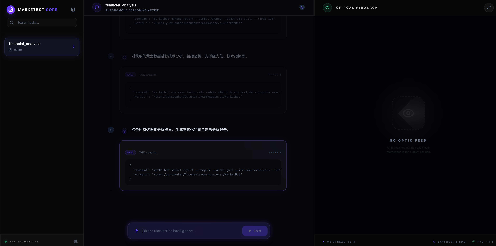
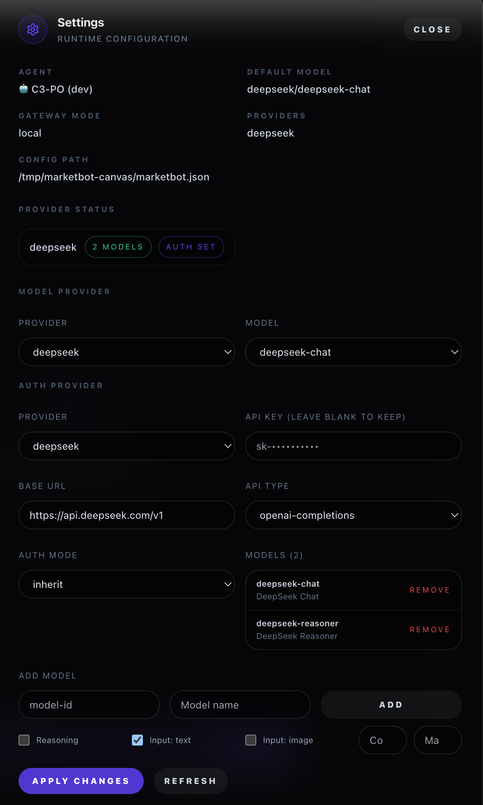

<p align="center">
  
</p>

# MarketBot Finance

> **Autonomous Financial Intelligence Agent with Multi-Channel Messaging**

[](LICENSE)
[](https://www.typescriptlang.org/)
[](https://nodejs.org/)

MarketBot Finance is an autonomous AI agent designed for financial analysis and market intelligence. It operates across multiple messaging platforms and provides deep reasoning capabilities through a multi-agent architecture.

---

## Architecture (MarketBot Focus)

MarketBot is designed around a **gateway-first runtime** with an **executor-driven task engine** that can operate in real time, across channels, and with tool-assisted research. The focus is actionable intelligence: structured analysis, clear risk/invalidation levels, and reproducible workflows.

```
┌─────────────────────────────────────────────────────────────┐
│                      MarketBot Architecture                    │
├─────────────────────────────────────────────────────────────┤
│                                                                │
│  ┌──────────────┐    WebSocket     ┌──────────────────────┐   │
│  │  Dashboard   │◄────────────────►│      Gateway         │   │
│  │   (UI-TARS)  │                  │   (WebSocket Hub)    │   │
│  └──────────────┘                  └──────────┬───────────┘   │
│        ▲                                      │               │
│        │           ┌──────────────────────────┐│               │
│        │           │      Executor Engine     ││               │
│        │           │  ┌──────────┐ ┌────────┐ ││               │
│        │           │  │  Intent  │ │  Task  │ ││               │
│        │           │  │  Parser  │ │Executor│ ││               │
│        │           │  └────┬─────┘ └───┬────┘ ││               │
│        └───────────│───────┴───────────┴──────││               │
│                    └──────────────────────────┘│               │
│                                                 │               │
│  ┌──────────────────────────────────────────────┴───────────┐  │
│  │                     Agents & Tools                          │  │
│  │  ┌──────────┐ ┌──────────┐ ┌──────────┐ ┌──────────┐     │  │
│  │  │  DeepSeek│ │  Claude  │ │  GPT-4   │ │  Gemini  │     │  │
│  │  └──────────┘ └──────────┘ └──────────┘ └──────────┘     │  │
│  │  ┌──────────┐ ┌──────────┐ ┌──────────┐ ┌──────────┐     │  │
│  │  │Web Search│ │  Desktop │ │ Browser  │ │  Memory  │     │  │
│  │  └──────────┘ └──────────┘ └──────────┘ └──────────┘     │  │
│  └──────────────────────────────────────────────────────────┘  │
│                                                                │
│  ┌──────────────────────────────────────────────────────────┐  │
│  │                     Channels                              │  │
│  │  Telegram │ Slack │ Discord │ WhatsApp │ Signal │ Feishu  │  │
│  │  iMessage │ Web   │  Teams  │  Matrix  │ Zalo   │  ...    │  │
│  └──────────────────────────────────────────────────────────┘  │
│                                                                │
└─────────────────────────────────────────────────────────────┘
```

### 1) Gateway-first Control Plane

- **Gateway**: Central WebSocket server for sessions, routing, and tool execution
- **Dashboard**: Web-based Control UI for task execution with visual step-by-step tracking
- **Executor Engine**: Intent parsing and task execution with desktop automation capabilities

### 2) Analysis Engine (Agents + Models)

- **Multi-Model Orchestration**: Agents coordinate across DeepSeek, Claude, GPT-4, Gemini
- **Model Fallbacks**: Automatic failover between providers for reliability
- **Structured Outputs**: Enforced prompts for consistent analysis formats

### 3) Tools and Skills

- **Web Intelligence**: Search, fetch, and browser automation
- **Desktop Automation** (macOS): Screenshot, click, type, move (UI-TARS compatible)
- **Memory**: Persistent context across sessions
- **Media**: Video frames, transcription, image analysis
- **Skills**: 55+ reusable workflows (finance, productivity, development)

### 4) Channels and Nodes

- **Messaging Platforms**: Telegram, Slack, Discord, WhatsApp, Signal, iMessage, Web, **Feishu**
- **Desktop App**: macOS native app with menu bar and voice control
- **Nodes**: Device clients (macOS/iOS/Android/headless) with canvas, camera, screen capabilities

### 5) Persistence and Configuration

- **State Directory**: `~/.marketbot` (sessions, logs, caches, config)
- **Config Format**: JSON5 with `MARKETBOT_CONFIG_PATH` override
- **Security**: Sensitive data (API keys) stored in environment or 1Password

## Core Components

| Component | Description |
|-----------|-------------|
| **Gateway** | WebSocket server for sessions, routing, and tool execution |
| **Executor** | Intent parser and task executor for multi-step AI workflows |
| **Dashboard** | Web-based task execution UI with visual step tracking |
| **Agents** | Multi-model prompt orchestration with structured outputs |
| **Channels** | Multi-platform messaging (Telegram, Slack, Discord, WhatsApp, Signal, iMessage, Feishu, Web) |
| **Tools** | Web search/fetch, browser automation, desktop control (macOS), memory, media, exec |
| **Skills** | 55+ reusable workflows for finance, productivity, and development |
| **Nodes** | Device clients (macOS/iOS/Android) with UI/canvas/camera/screen capabilities |

## Repo Layout

| Directory | Contents |
|-----------|----------|
| `src/agents/` | Agent runtime, prompts, compaction, tools (web, desktop, browser) |
| `src/gateway/` | WebSocket server, protocol handling, routing, executor handlers |
| `src/executor/` | Intent parser and task executor for multi-step workflows |
| `src/channels/` | Channel adapters (Telegram, Slack, Discord, Feishu, etc.) |
| `src/memory/` | Memory store and retrieval |
| `src/providers/` | Model/provider integrations (DeepSeek, OpenAI, Anthropic, Gemini) |
| `extensions/` | Plugin manifests and optional integrations |
| `skills/` | Reusable skills and workflows (55+ available) |
| `apps/` | Native clients (macOS, iOS, Android) |
| `dashboard/` | Web-based task execution dashboard (React + Vite) |
| `docs/` | Documentation sources |

---

## Quick Start

### Installation

```bash
git clone https://github.com/EthanAlgoX/MarketBot.git
cd MarketBot
pnpm install
pnpm build
pnpm ui:build
```

#### 1. Configure MarketBot

Launch the interactive onboarding wizard to configure your model providers and API keys.

```bash
pnpm start -- onboard
```

> [!TIP]
> This will guide you through setting up your AI providers (DeepSeek, OpenAI, etc.) and save the configuration to `marketbot.json`.

#### 2. Start the Gateway

The Gateway manages your sessions and model connections. **You must leave this process running.**

```bash
pnpm start -- gateway
```

#### 3. Open the GUI (web)

Open the Control UI in your browser:

```bash
# Option 1: Web Control UI (main interface)
http://127.0.0.1:18789/

# Option 2: Task Execution Dashboard (for executor workflows)
cd dashboard && pnpm dev
# Then open http://localhost:3000
```

If the page fails to load, confirm the Gateway is running and the UI is built with `pnpm ui:build`.

#### Web UI Screenshots

The Web Control UI (webui.png) is the primary interface for running tasks, monitoring step-by-step execution, and opening Settings to configure model and auth providers.




---

### Desktop Automation (macOS)

MarketBot includes a **Desktop Tool** for macOS automation, enabling AI agents to control your desktop:

```bash
# Screenshot, click, type, move cursor
# Example: "Take a screenshot and click on the Chrome icon"
```

**Requirements:**
- macOS with Accessibility permissions enabled for Terminal/VS Code
- Only available on macOS platform

---

### Dashboard Development

The Task Execution Dashboard provides visual tracking of AI task execution with step-by-step screenshots:

```bash
# Start dashboard development server
pnpm dashboard:dev

# Dashboard features:
# - Visual step-by-step task execution tracking
# - Screenshot timeline for desktop automation
# - Search and filter task history
# - Real-time WebSocket updates
```

---

MarketBot is best configured using the interactive onboarding wizard:

```bash
pnpm start -- onboard
```

### Environment Variables

While most configuration lives in `marketbot.json`, you can use these environment variables for advanced setup:

| Variable | Description |
|----------|-------------|
| `MARKETBOT_GATEWAY_TOKEN` | Secure token for Gateway authentication |
| `MARKETBOT_CONFIG_PATH` | Path to config file (default: `~/.marketbot/marketbot.json`) |
| `MARKETBOT_STATE_DIR` | Directory for sessions, logs, and caches |

---

## Skills

MarketBot supports 55+ extensible skills:

| Category | Skills |
|----------|--------|
| **Finance** | market-report, catalyst-tracker |
| **Productivity** | notion, obsidian, apple-notes, trello |
| **Development** | github, coding-agent, skill-creator |
| **Communication** | discord, slack, telegram, **feishu** |
| **Media** | video-frames, openai-whisper, camsnap |
| **Utilities** | weather, 1password, tmux, **desktop** (macOS) |

```bash
# List available skills
pnpm start -- skills list

# Install a skill
pnpm start -- skills install <skill-name>

# Example: Install Feishu channel
pnpm start -- skills install feishu
```

---

## Deployment

### Docker

```bash
docker-compose up -d
```

### Systemd (Linux)

```bash
pnpm start -- gateway install
sudo systemctl enable marketbot
sudo systemctl start marketbot
```

---

## Documentation

| Topic | Link |
|-------|------|
| Agent Configuration | [docs.marketbot.ai/concepts/agent](https://docs.marketbot.ai/concepts/agent) |
| Skill Development | [docs.marketbot.ai/cli/skills](https://docs.marketbot.ai/cli/skills) |
| Channel Setup | [docs.marketbot.ai/concepts/group-messages](https://docs.marketbot.ai/concepts/group-messages) |
| Control UI (Web) | [docs.marketbot.ai/web/control-ui](https://docs.marketbot.ai/web/control-ui) |
| Dashboard / Task Execution | [docs.marketbot.ai/web/dashboard](https://docs.marketbot.ai/web/dashboard) |
| Desktop Automation | [docs.marketbot.ai/tools/desktop](https://docs.marketbot.ai/tools/desktop) |
| Feishu Channel | [docs.marketbot.ai/channels/feishu](https://docs.marketbot.ai/channels/feishu) |

## Recent Updates

### v2026.2.x
- ✅ **Task Execution Dashboard**: New web UI for visual task tracking with step-by-step screenshots
- ✅ **Desktop Tool (macOS)**: AI-powered desktop automation (screenshot, click, type, move)
- ✅ **Feishu Channel**: Full integration with Feishu/Lark messaging platform
- ✅ **Executor Engine**: Multi-step task orchestration with intent parsing
- ✅ **Dashboard Development Mode**: `pnpm dashboard:dev` for local dashboard development

---

## License

This project is licensed under the **GNU Affero General Public License v3.0 (AGPL-3.0)**. See [LICENSE](LICENSE) for details.
