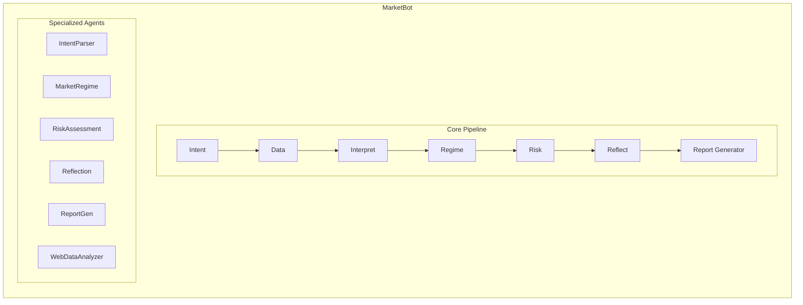

<div align="center">

# 📈 MarketBot

[](https://www.gnu.org/licenses/agpl-3.0)
[](https://www.typescriptlang.org/)
[](https://nodejs.org/)

> 🤖 Multi-Agent Market Analysis System | Crypto · Stocks · Futures · Forex | AI-Powered Decision Dashboard

[**Features**](#-features) • [**Quick Start**](#-quick-start) • [**Architecture**](#-architecture) • [**Configuration**](#-configuration)

English | [简体中文](README_CN.md)

</div>

## ✨ Features

### 🎯 Core Features

- **AI Decision Dashboard** - One-line conclusion + precise entry/exit levels + risk checklist
- **Multi-Agent Collaboration** - Intent → Regime → Risk → Reflection → Report
- **Browser Automation** - Auto-search news, scrape web pages for real-time analysis
- **Multi-Market Support** - Crypto, US/HK/A-shares, Futures, Forex, and any searchable assets
- **Multi-Channel Push** - WeChat Work, Feishu, Telegram, Webhook

### 🛡️ Built-in Trading Philosophy

- ❌ **No Chasing** - Auto-flag "Danger" when deviation > 5%
- ✅ **Trend Trading** - MA5 > MA10 > MA20 bullish alignment
- 📍 **Precise Levels** - Entry, stop-loss, target prices
- 📋 **Checklist** - Each condition marked with ✅⚠️❌

### 📊 Data Sources

- **Market Data**: Yahoo Finance, Binance (auto-switch)
- **News Search**: Browser automation (DuckDuckGo/Bing)
- **AI Analysis**: OpenAI-compatible APIs (OpenAI/Gemini/Claude/Qwen/Moonshot/Ollama)

## 🎥 Demo

> **Query**: `marketbot web-analyze "Analyze Google"`  
> **Result**: Automatic English Report Generation

```markdown
# 📄 AI Stock Analysis Report
---
📅 **2026-01-31T14:15:00.000Z** | *AI Stock Trading Snapshot*

💵 **Current Price**: 175.50 USD | GOOGL | Yahoo Finance @ 14:15

## 🟦 Core Conclusion
| Direction & Confidence | Params | Rationale |
|:---|:---|:---|
| 🟢 **LONG ↑** | Entry: 172.00 | Uptrend |
| ⭐⭐⭐⭐☆ (85/100) | TP: 195.00 | Bullish |
| **Uptrend** | SL: 165.00 | Positive Crossover |

## 🟨 Market & Status
| Regime | Status |
|:---|:---|
| Regime: Risk-On 📈 | Trend: Uptrend |
| Volatility: Medium | Structure: Bullish |

## 🟩 Key Drivers
### 📊 Technicals
- MA: Bullish
- MACD: Positive Crossover
- RSI: Neutral (55)

### 📰 Events/Fundamentals
- Dominant market share in Search (>90%)
- Aggressive AI integration with Gemini models
- Cloud revenue growing +25% YoY
- Facing antitrust scrutiny in EU and US

## 🟥 Risks & Invalidation
### ⚠️ Main Risks
- Regulatory/Antitrust fines
- AI competition (OpenAI/Microsoft)
---
> ⚠️ **Disclaimer**: Generated by AI for research only. Not financial advice.
```

## 🚀 Quick Start

### 1. Installation

```bash
git clone https://github.com/EthanAlgoX/MarketBot.git
cd MarketBot
npm install
npm run build
```

### 2. Configure API Key

**Support for OpenAI-compatible APIs (OpenAI, Gemini, Claude, Qwen, Moonshot, Ollama)**

Detailed configuration can be found in [Configuration](#-configuration) section.

**Example: OpenAI (Default)**

```bash
# Option 1: Environment variable
export OPENAI_API_KEY="sk-..."

# Option 2: .env file
echo 'OPENAI_API_KEY=sk-...' > .env
```

### 3. Run Analysis

```bash
# Analyze stock
node dist/index.js web-analyze "GOOGL stock analysis"

# Analyze cryptocurrency
node dist/index.js web-analyze "BTC price prediction"

# Asset mode (auto-search price, news, sentiment)
node dist/index.js web-analyze --asset ETH

# Standard Analysis (Market Data Only)
node dist/index.js analyze "Analyze Apple"

# Test without API Key (Mock Mode)
node dist/index.js analyze "Analyze BTC" --mock
```

### 3b. GUI / TUI

```bash
# Start web GUI (opens browser)
node dist/index.js gui

# Start terminal UI
node dist/index.js tui
```

TUI commands: `/help`, `/exit`, `/history`, `/use <n>`, `/json on|off`, `/mode <mock|auto|api|scrape|none>`, `/search on|off`, `/scrape on|off`, `/agent <id|clear>`, `/session <key|clear>`.

### 4. Done

First run will automatically download Chromium for web search.

## 📱 Output Example

### Decision Dashboard

```
📄 AI Stock Analysis Report
---
📅 2026-01-31 | AI Stock Trading Snapshot

## 🟦 Core Conclusion

| Direction & Confidence | Trading Params | Core Logic |
|:---|:---|:---|
| 🟢 LONG ↑ | Entry: $338.00 | Uptrend |
| ⭐⭐⭐⭐☆ (80/100) | TP: $350.00 | Bullish MA |
| **Trending Up** | SL: $320.00 | MACD Cross |

### 🧠 Agentic Mode (New)

The agentic mode allows the LLM to autonomously decide which tools to use and how to analyze data, rather than following a fixed pipeline.

```bash
# Enable agentic mode with --agentic flag
node dist/index.js analyze "Deep analysis of NVIDIA" --agentic

# With verbose output to see tool calls
node dist/index.js analyze "Compare BTC and ETH" --agentic --verbose
```

## 🟩 Key Drivers

### 📊 Technical

- MA: Bullish alignment
- MACD: Golden cross
- RSI: Normal range

### 📰 Events/Fundamentals

- Earnings on 2/4
- Analyst rating: Strong Buy

## 🟥 Risk & Invalidation

- Market volatility risk
- Invalidated if daily close < $320

---
⚠️ Disclaimer: AI-generated report for research only, not investment advice.

```

## 🏗️ Architecture



### Agent Modules

| Agent | Responsibility | Output |
|-------|----------------|--------|
| **IntentParser** | Parse user query intent | asset, market, timeframes |
| **MarketDataInterpreter** | Interpret market data | structure, volatility, momentum |
| **MarketRegime** | Identify market regime | regime, strategy, confidence |
| **RiskAssessment** | Evaluate trading risk | risk_level, position_size |
| **Reflection** | Synthesize analysis | confidence, alternatives |
| **ReportGenerator** | Generate pro report | Markdown Report |
| **WebDataAnalyzer** | Web search + analysis | search results, report |

## Architecture

MarketBot is built on a **Agentic Architecture** designed for autonomous decision making, consistent with the design principles of [Moltbot](https://github.com/moltbot/moltbot).

- **Agent Core**: Uses an autonomous loop (`src/core/agentLoop.ts`) to analyze user intent, plan tool usage, and execute steps.
- **Tools System**: First-class tool definitions (`src/tools`) that the agent can autonomously select and invoke (e.g., `market_fetch`, `indicators_compute`).
- **Flexible Providers**: Supports pluggable LLM backends (OpenAI Compatible, Mock).
- **Multi-Interface**: Accessible via CLI and Web Dashboard.

> **Note**: Like Moltbot, MarketBot is designed to "think" before it acts, autonomously deciding the best way to fulfill your market analysis requests.

## 🧰 Default Skills

Default skills are preloaded under `src/skills`:

- `market-scan` (tool: `market_fetch`)
- `market-summary` (tool: `market_summary`)
- `indicator-check` (tool: `indicators_compute`)
- `report-render` (tool: `report_render`)
- `web-fetch` (tool: `http_get`)
- `stock-analysis` (fetch/summary/report for equities)
- `crypto-analysis` (fetch/summary/report for crypto)
- `forex-analysis` (fetch/summary/report for FX)
- `futures-analysis` (fetch/summary/report for futures)
- `volatility-check` (quick ATR/volume/momentum summary)
- `multi-timeframe-scan` (scan 15m/1h/4h/1d structure)
- `trend-strength` (quick trend/momentum read)
- `support-resistance` (nearest levels)
- `pair-compare` (side-by-side asset comparison)
- `risk-check` (risk-focused report)

## ⚙️ Configuration

### 🔐 OAuth (Bring Your Own Identity)

MarketBot supports authenticating via OAuth to access LLM providers (Google Gemini, OpenAI Codex) directly with your own account.

```bash
# Login with Google (Gemini)
npx tsx src/index.js auth login --provider google

# Login with OpenAI (Codex/ChatGPT Subscription)
npx tsx src/index.js auth login --provider openai-codex
```

Once authenticated, MarketBot **automatically prefers** your OAuth credentials over local configuration (`marketbot.json`) or environment variables.

**Manage Authentication:**

```bash
# Check status
npx tsx src/index.js auth status --provider all

# Logout
npx tsx src/index.js auth logout --provider google
```

### 🤖 AI Model Configuration (Zero-Config)

MarketBot supports "Zero-Config" mode using Environment Variables. No `marketbot.json` required!

**Option 1: Google Gemini (Free Tier)**

```bash
export GEMINI_API_KEY="AIzaSy..."
```

**Option 2: OpenAI / Compatible (DeepSeek, etc)**

```bash
export OPENAI_API_KEY="sk-..."
export OPENAI_BASE_URL="https://api.deepseek.com/v1"  # Optional
export OPENAI_MODEL="deepseek-chat"                   # Optional
```

| Env Variable | Description | Required |
|--------------|-------------|:--------:|
| `GEMINI_API_KEY` | Google Gemini API Key | Optional* |
| `OPENAI_API_KEY` | OpenAI / Compatible API Key | Optional* |
| `OPENAI_BASE_URL` | Custom Base URL (e.g. DeepSeek) | Optional |
| `OPENAI_MODEL` | Custom Model Name (default: gpt-4o-mini) | Optional |

> \* One of `GEMINI_API_KEY` or `OPENAI_API_KEY` is required.

<details>
<summary><b>Advanced: marketbot.json Configuration</b></summary>

You can still use `marketbot.json` for complex setups.

```json
{
  "llm": {
    "provider": "openai-compatible",
    "apiKey": "sk-...",
    "model": "gpt-4o",
    "baseUrl": "https://api.openai.com/v1"
  }
}
```

</details>

### 🔔 Notification Configuration

Configure channels via Environment Variables or `.env` file. You can configure multiple channels simultaneously.

| Env Variable | Description | Required |
|--------------|-------------|:--------:|
| `WECHAT_WEBHOOK_URL` | Enterprise WeChat Webhook URL | Optional |
| `FEISHU_WEBHOOK_URL` | Feishu (Lark) Webhook URL | Optional |
| `TELEGRAM_BOT_TOKEN` | Telegram Bot Token (@BotFather) | Optional |
| `TELEGRAM_CHAT_ID` | Telegram Chat ID | Optional |
| `PUSHPLUS_TOKEN` | PushPlus Token (<http://www.pushplus.plus>) | Optional |
| `CUSTOM_WEBHOOK_URL` | Custom Webhook URL | Optional |
| `CUSTOM_WEBHOOK_BEARER_TOKEN` | Bearer Token for Custom Webhook | Optional |

## 🖥️ HTTP API

```bash
# Start server
node dist/index.js server --port 8787

# Health check
curl http://127.0.0.1:8787/health

# Analyze
curl -X POST http://127.0.0.1:8787/analyze \
  -H "Content-Type: application/json" \
  -d '{"query":"Analyze BTC"}'
```

## 📁 Project Structure

MarketBot/
├── src/
│   ├── agents/          # Specialized Agents (7)
│   ├── cli/             # CLI commands and entry point
│   ├── config/          # Configuration and defaults
│   ├── core/            # Pipeline, LLM interface, Prompts
│   ├── pipeline/        # Stock analysis pipeline
│   ├── server/          # HTTP server & Gateway
│   ├── services/        # Unified service layer
│   ├── skills/          # Skill system (defaults in /defaults)
│   ├── tools/           # Tool dispatch
│   └── web/             # Browser search/scrape
├── marketbot.json       # Config file
└── package.json

## 🗺️ Roadmap

### 🔔 Notification Channels

- [x] WeChat Work Bot
- [x] Feishu Bot
- [x] Telegram Bot
- [x] Custom Webhook
- [ ] Email Notification

### 🤖 AI Models

- [x] OpenAI GPT-4/GPT-4o
- [x] OpenAI-compatible APIs
- [x] Qwen
- [ ] Local Models (Ollama)

### 📊 Data Sources

- [x] Yahoo Finance
- [x] Binance
- [x] Browser Search
- [ ] Tushare Pro
- [ ] AkShare

### 🎯 Features

- [x] Decision Dashboard
- [x] Multi-Agent Collaboration
- [x] One-Page Report
- [x] HTTP API
- [ ] Historical Backtesting
- [ ] GitHub Actions Scheduled Run

## ⚠️ Disclaimer

This project is for learning and research purposes only and does not constitute any investment advice. The stock market is risky, please invest cautiously. The author is not responsible for any losses resulting from the use of this project.

## 📄 License

[AGPL-3.0 License](LICENSE) © 2026 EthanAlgoX

---

<div align="center">

**If you find it useful, please give it a ⭐ Star!**

</div>
