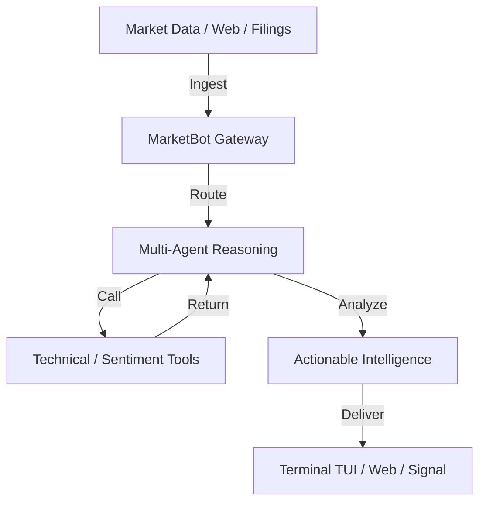

<p align="center">
  
</p>

# 📈 MarketBot Finance

> **Autonomous Financial Intelligence & Quantitative Analysis Engine**

[](LICENSE)
[](#)
[](#)
[](#)

**MarketBot Finance** is a high-performance, programmable financial agent designed to autonomously analyze markets, aggregate economic intelligence, and provide actionable trading insights. Built on a multi-agent reasoning framework, it bridges the gap between raw market data and high-stakes decision making.

---

## 💎 Core Pillars

### 🧠 Deep Reasoning & Multi-Agent Logic

MarketBot Finance doesn't just fetch data; it *understands* it. By coordinating multiple specialized agents, it can cross-reference technical signals with sentiment analysis and fundamental reports.

### 🌐 Autonomous Market Research

When data is missing or out-of-date, MarketBot Finance launches its own browser-based research sessions to hunt for real-time news, filings, and sentiment indicators across the web.

### 🔌 Extensible Skill Architecture

A professional-grade plugin system allows you to build custom data pipelines, proprietary indicators, and specialized analysis workflows in TypeScript.

---

## 🏛️ Architecture



---

## 🚀 Quick Start

### 1. Installation

```bash
git clone https://github.com/yourusername/marketbot.git
cd marketbot
pnpm install
pnpm build
```

### 2. Launch the Control Center (TUI)

Experience the full power of MarketBot through its interactive terminal interface:

```bash
pnpm tui
```

### 3. Example Queries

- `Evaluate NVDA technicals against current semiconductor sentiment.`
- `Analyze BTC support levels using Volume Profile and RSI.`
- `Scan for latest FOMC minutes and summarize market impact.`

---

## 🛠️ Specialized Tooling

MarketBot Finance includes built-in tools for:

- **Web Research**: Headless browser automation for real-time data scraping.
- **Data Analysis**: Local and LLM-driven quantitative auditing.
- **Multimodal**: Image analysis for chart pattern recognition.
- **Connectivity**: Integrated delivery via Signal, Telegram, Slack, and Discord.

---

## 📜 License

This project is licensed under the **GNU Affero General Public License v3.0 (AGPL-3.0)**.
See [LICENSE](LICENSE) for details.
