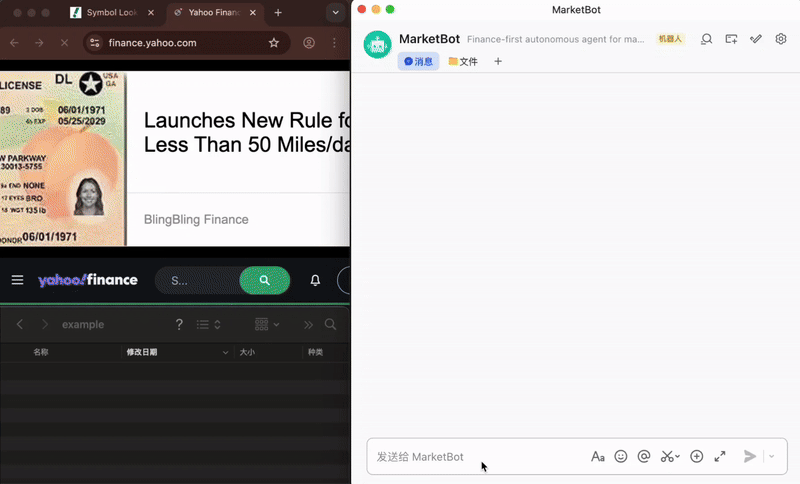
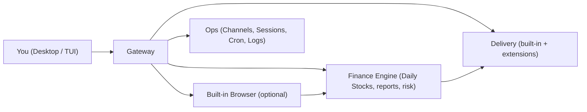

<p align="center">
  
</p>

# MarketBot

Finance-first autonomous agent for market research and multi-channel delivery.

[](LICENSE)
[](https://www.typescriptlang.org/)
[](https://nodejs.org/)



A single command for the entire stock analysis workflow -- turns "download data, analyze, visualize, report" into a single AI task.

## What MarketBot Does

- Turns market context into repeatable analysis.
- Fetches data via APIs, scraping, or a built-in browser profile.
- Produces research-style markdown outputs (briefs, decision dashboards).
- Delivers results to chat channels and scheduled runs.

## Core Features

- **Daily Stocks**: watchlist-driven, repeatable daily analysis with decision dashboards and report output
- **Research Chat**: browse, capture sources, and write memo-like summaries (finance tone)
- **Desktop App**: standalone Electron app with native sidebar, embedded Control UI, and auto-managed gateway
- **Portfolio analytics**: risk, correlation, optimization, and comparisons
- **File analysis**: summarize local CSV/JSON/PDF and generate finance-style notes
- **Delivery ops**: connect channels, inspect sessions, schedule cron, tail logs
- **Multi-channel delivery**: built-in channels plus optional extensions (including China IM plugins)

## Architecture

MarketBot is structured as a local Gateway that exposes finance and ops capabilities to both the Desktop app and TUI.


```mermaid
flowchart LR
  U["You (Desktop / TUI)"] --> G["Gateway"]
  G --> B["Built-in Browser (optional)"]
  G --> F["Finance Engine (Daily Stocks, reports, risk)"]
  G --> O["Ops (Channels, Sessions, Cron, Logs)"]
  G --> D["Delivery (built-in + extensions)"]
  B --> F
  F --> D
```

Key design choices:

- **Browser data capture**: a managed browser profile is available for pages that block direct API access.
- **Report outputs**: primary outputs are markdown reports intended to read like research notes.
- **Separation of concerns**: finance calculations are deterministic; agent writing and summarization is layered on top.
- **Delivery is explicit**: connect a channel, verify status, then send or schedule.

## MarketBot Desktop

MarketBot Desktop is a standalone Electron application. Install it, launch it, and it works -- no manual gateway setup, no token configuration, no terminal commands.

**What happens on first launch:**

1. The app creates `~/.marketbot/marketbot.json` with a generated auth token (if no config exists).
2. The gateway starts automatically as a background subprocess on port 18789.
3. The UI connects to the gateway and loads the Chat tab.

**What happens on subsequent launches:**

1. The existing config and token are reused.
2. If an external gateway is already running (e.g. started from the CLI), the app piggybacks on it instead of spawning a duplicate.
3. If the gateway crashes, the app restarts it automatically after 3 seconds.

**Sidebar navigation:**

| Section | Tabs |
|---------|------|
| Chat | Chat |
| Finance | Desk, Stocks, Runs |
| Control | Connection, Config, Channels, Sessions, Cron Jobs, Logs |

### Running the Desktop App

**Development mode** (hot-reload for renderer):

```bash
# 1. Install deps and build core + Control UI (first time only)
pnpm install
pnpm build
pnpm ui:build

# 2. Start the gateway (required -- dev mode does not auto-start it)
pnpm -s marketbot gateway run --bind loopback --port 18789 --force

# 3. In a separate terminal, start the Desktop app
pnpm desktop:dev
# or equivalently:
#   pnpm --dir apps/desktop dev
```

**Production-like local run** (builds the Electron app, then launches it):

```bash
pnpm --dir apps/desktop start
```

This auto-starts the gateway as a subprocess, same as the packaged app.

### Building the Desktop App (Production)

```bash
# Build for macOS (DMG + ZIP, arm64 + x64)
pnpm --dir apps/desktop package:mac

# Build for other platforms
pnpm --dir apps/desktop package:win
pnpm --dir apps/desktop package:linux
pnpm --dir apps/desktop package:all
```

The built installers are written to `apps/desktop/release/`.

## Quick Start (CLI)

If you prefer the CLI over the Desktop app:

```bash
git clone https://github.com/marketbot/marketbot.git
cd marketbot
pnpm install
pnpm build
pnpm ui:build
```

### Quick Start with Local LLM

MarketBot works out-of-the-box with **Qwen3-0.6B** via Ollama.

```bash
# One-shot quickstart (configure Qwen3-0.6B + start Gateway)
pnpm quickstart:web
```

<details>
<summary>Manual Local LLM Setup</summary>

1. **Install Ollama**: [Download from ollama.com](https://ollama.com) or `brew install ollama`.
2. **Pull Model**: `ollama pull qwen3:0.6b` (or any other model you prefer).
3. **Configure**: `pnpm -s marketbot setup` or `pnpm -s marketbot onboard`.
4. **Start**: `pnpm -s marketbot gateway run --bind loopback --port 18789`.

</details>

### Configuration

MarketBot uses `~/.marketbot/marketbot.json` for configuration. The Desktop app creates this file automatically on first launch.

To use cloud APIs (like DeepSeek or OpenAI):

1. Open the Config tab in the Desktop app (or edit `~/.marketbot/marketbot.json` directly).
2. Add a provider with your API key.
3. Set `agents.defaults.model.primary` to the cloud model ID.

### Gateway and Control UI

The Gateway serves the Control UI as a built-in web interface. You can access it directly in a browser as a fallback:

```text
http://127.0.0.1:18789/
```

Primary pages:

- Desk: `/desk`
- Stocks: `/stocks`
- Research Chat: `/chat`
- Connection: `/overview`
- Config: `/config`
- Channels: `/channels`
- Sessions: `/sessions`
- Cron: `/cron`
- Logs: `/logs`

Notes:

- The Control UI is served by the Gateway (no separate web server).
- `pnpm ui:dev` is for Control UI frontend development only.
- Gateway auth is required by default. The Desktop app handles this automatically. For browser access, use the token from `~/.marketbot/marketbot.json`.

Key design choices:

- Browser data capture: a managed browser profile is available for pages that block direct API access.
- Report outputs: primary outputs are markdown reports intended to read like research notes.
- Separation of concerns: finance calculations are deterministic; agent writing and summarization is layered on top.
- Delivery is explicit: connect a channel, verify status, then send or schedule.

## Daily Stocks (Design)

Daily Stocks is a first-class workflow (think: a built-in skill).

Inputs:

- Watchlist (one symbol per line)
- Timeframe
- Report mode (simple/full)
- Optional fundamentals toggle

Outputs:

- Decision dashboard summary
- Research-style markdown report per symbol
- Persisted "last run" snapshot for the Desk

## Research + File Analysis (Design)

Research is optimized for "browse, capture, synthesize" with citations and clear assumptions.

File analysis supports local datasets:

- CSV/JSON: quick schema + anomalies + key stats
- PDFs: extract relevant sections and summarize for finance use cases

## Quick Start (Dev)

Prereqs: Node 22+, pnpm.

```bash
git clone https://github.com/marketbot/marketbot.git
cd marketbot
pnpm install
pnpm build
pnpm ui:build
```

### Quick Start with Local LLM (Recommended)

MarketBot works out-of-the-box with **Qwen3-0.6B** via Ollama.

```bash
# 1. One-shot quickstart (configure Qwen3-0.6B + start Desktop + Gateway)
pnpm quickstart:web
```

To run without auto-opening the browser:

```bash
pnpm quickstart:web -- --no-open
```

Then open MarketBot Desktop:

```bash
# Production-like local run (auto-starts gateway)
pnpm --dir apps/desktop start

# Or dev mode (hot-reload, requires gateway running separately)
pnpm desktop:dev
```

MarketBot Desktop auto-starts the gateway on launch (in `start` mode) and stops it on quit.
In `dev` mode, start the gateway manually first: `pnpm -s marketbot gateway run --bind loopback --port 18789 --force`.
If the UI shows `unauthorized`, paste `gateway.auth.token` from `~/.marketbot/marketbot.json`
into the Control UI "Gateway Token" field and connect.

<details>
<summary>Manual Local LLM Setup (Click to expand)</summary>

If you prefer to set up manually:

1. **Install Ollama**: [Download from ollama.com](https://ollama.com) or `brew install ollama`.
2. **Pull Model**: `ollama pull qwen3:0.6b` (or any other model you prefer).
3. **Configure**: Copy `marketbot.json.example` to `marketbot.json`.
4. **Start**: `pnpm -s marketbot gateway run --bind loopback --port 18789`.

</details>

### configuration

MarketBot uses `marketbot.json` for configuration. The default local setup uses **Qwen3** via Ollama.

To use cloud APIs (like DeepSeek or OpenAI):

1. Edit `marketbot.json`.
2. Uncomment the provider configuration (e.g., `deepseek`).
3. Add your API key.
4. Change `agents.defaults.model.primary` to the cloud model ID.

Or continue with manual dev setup:

```bash
pnpm -s marketbot setup
# or
pnpm -s marketbot onboard
```

Run a local gateway:

```bash
pnpm -s marketbot gateway run --bind loopback --port 18789
```

Open the Control UI directly in a browser (dev/ops fallback):

```text
http://127.0.0.1:18789/
```

Notes:

- The Web Control UI is served by the Gateway (no separate web server in the product).
- `pnpm ui:dev` is only for Control UI frontend development.
- Gateway auth is required by default. If you see `unauthorized`, paste the value of `gateway.auth.token` into the Control UI "Gateway Token" field, then click Connect.

Primary pages:

- Desk: `/` (or `/desk`)
- Stocks: `/stocks`
- Ops: `/channels` `/sessions` `/cron` `/logs`
- Research: `/chat`
- Connection: `/overview`
- Config: `/config`

If your config is not yet set up for local mode, either run `setup/onboard` or explicitly set:

```bash
pnpm -s marketbot config set gateway.mode local
```

## Symbol Conventions (Yahoo-backed, browser-fetched)

- US equities: `AAPL`, `NVDA`
- China A-share: `600519` (auto-normalizes to `600519.SS`), `000001` (auto-normalizes to `000001.SZ`)
- Hong Kong: `hk00700`, `00700`, `700` (auto-normalizes to `00700.HK`)

## TUI (Finance Desk + File Processing)

The TUI supports slash commands and can summarize local CSV/JSON/text files without any model:

```bash
pnpm -s marketbot tui --url ws://127.0.0.1:18789 --token "<gateway-token>"
```

Inside the TUI:

```text
/file example/portfolio_holdings.csv
/file example/financial_statements.csv
/quit
```

Non-interactive (execute a slash command at startup):

```bash
pnpm -s marketbot tui --url ws://127.0.0.1:18789 --token "<gateway-token>" --message "/file example/portfolio_holdings.csv"
```

## Channels + Messaging

Use the Web Control UI Ops pages first:

- Channels: `/channels`
- Sessions: `/sessions`
- Cron: `/cron`
- Logs: `/logs`

Available channels (built-in + extensions):

| Channel | Kind | Notes |
|---|---|---|
| Telegram | Core | Bot API |
| WhatsApp | Core | WhatsApp Web (QR link) |
| Discord | Core | Bot API |
| Google Chat | Core | Chat API / webhook |
| Slack | Core | Socket Mode |
| Signal | Core | signal-cli linked device |
| iMessage | Core | native iMessage integration |
| BlueBubbles | Core | iMessage via BlueBubbles Server |
| Mattermost | Core | webhooks |
| Feishu/Lark (飞书) | Core | enterprise messaging ([Setup](#feishu-setup)) |
| DingTalk (钉钉) | Extension | China IM ([Setup](#dingtalk-setup)) |
| WeCom (企业微信) | Extension | China IM ([Setup](#wecom-setup)) |
| QQ Bot (QQ 机器人) | Extension | China IM ([Setup](#qqbot-setup)) |
| LINE | Extension | LINE Messaging API |
| Matrix | Extension | Matrix homeserver |
| Microsoft Teams | Extension | Bot / Graph integration |
| Nextcloud Talk | Extension | Nextcloud Talk |
| Nostr | Extension | Nostr relays (chat-like surface) |
| Tlon | Extension | Urbit via Tlon |
| Zalo | Extension | Zalo OA |
| Zalo Personal | Extension | personal Zalo bridge |

### IM Platform Setup

<span id="feishu-setup"></span>
<details>
<summary><b>Feishu/Lark (飞书)</b></summary>

### 1. Create App & Get Credentials

1. Go to [Feishu Open Platform](https://open.feishu.cn/) -> Create Custom App.
2. Add capability: **Bot**.
3. Get **App ID** and **App Secret**.
4. Enable Permissions (see below).
5. Configure Event Subscription (see below).

### 2. Required Permissions

| Permission | Scope | Reason |
|---|---|---|
| `contact:user.base:readonly` | User Info | Parse sender names |
| `contact:contact.base:readonly` | Contacts | Basic info |
| `im:message` | Message | Send/Receive |
| `im:message.p2p_msg:readonly` | Private | Read DMs |
| `im:message.group_at_msg:readonly` | Group | Read @bot messages |
| `im:message:send_as_bot` | Send | Send as bot |
| `im:resource` | Media | Upload/Download files |

### 3. Event Subscription (Crucial!)

1. Go to **Event Subscriptions**.
2. Encrypt Key / Verification Token are optional but recommended.
3. Add events:
   - `im.message.receive_v1` (Receive messages)
   - `im.chat.member.bot.added_v1`
   - `im.chat.member.bot.deleted_v1`
4. Apply for publication and version release.

### 4. Configuration (`marketbot.json`)

```json
"channels": {
  "feishu": {
    "enabled": true,
    "appId": "cli_...",        // or "${FEISHU_APP_ID}"
    "appSecret": "..."         // or "${FEISHU_APP_SECRET}"
    // "encryptKey": "...",    // Optional
    // "verificationToken": "..." // Optional
  }
}
```

</details>

<span id="dingtalk-setup"></span>
<details>
<summary><b>DingTalk (钉钉)</b></summary>

### 1. Create App

1. Go to [DingTalk Developer](https://open-dev.dingtalk.com/).
2. Create **Internal App**.
3. Add **Bot** capability.
4. Set Message Receive Mode to **Stream Mode**.
5. Publish.

### 2. Configuration (`marketbot.json`)

```json
"channels": {
  "dingtalk": {
    "enabled": true,
    "clientId": "...",     // AppKey
    "clientSecret": "..."  // AppSecret
  }
}
```

</details>

<span id="qqbot-setup"></span>
<details>
<summary><b>QQ Bot (QQ 机器人)</b></summary>

### 1. Create App

1. Go to [QQ Open Platform](https://q.qq.com/).
2. Create Bot App.
3. Get **AppID** and **AppSecret**.
4. Configure IP Whitelist for your server.

### 2. Configuration (`marketbot.json`)

```json
"channels": {
  "qqbot": {
    "enabled": true,
    "appId": "...",
    "secret": "..."
  }
}
```

</details>

<span id="wecom-setup"></span>
<details>
<summary><b>WeCom (企业微信)</b></summary>

### 1. Create App

1. Go to [WeCom Admin](https://work.weixin.qq.com/).
2. Create "Self-built" App.
3. Enable API for Bot.
4. Set Token and EncodingAESKey.
5. Set URL to `http://your-server/webhooks/wecom` (requires public IP).

### 2. Configuration (`marketbot.json`)

```json
"channels": {
  "wecom": {
    "enabled": true,
    "corpId": "...",
    "agentId": "...",
    "secret": "...",
    "token": "...",
    "encodingAesKey": "..."
  }
}
```

</details>

```bash
pnpm -s marketbot channels list
pnpm -s marketbot channels status --probe
pnpm -s marketbot message send --channel telegram --target @your_chat --message "Hello"
```

Extensions live under `extensions/*`. Enable extension channels via:

```bash
pnpm -s marketbot plugins list
pnpm -s marketbot plugins enable dingtalk
pnpm -s marketbot plugins enable wecom
pnpm -s marketbot plugins enable qqbot
pnpm -s marketbot plugins enable matrix
pnpm -s marketbot plugins enable msteams
pnpm -s marketbot plugins enable line
```

## CLI (Dev/Automation)

This repo ships a CLI for scripting and dev workflows. The primary user surfaces are Web Control UI and TUI.

## Repo Layout

| Directory | Contents |
|-----------|----------|
| `src/` | CLI, gateway, channels, browser, finance, infra |
| `extensions/` | Optional plugins (workspace packages) |
| `skills/` | Reusable skills and workflows |
| `apps/` | Native clients (macOS, iOS, Android) |
| `ui/` | Web Control UI (current) |
| `docs/` | Documentation sources |

## Development

```bash
pnpm lint
pnpm test
pnpm build
```

## Documentation

- CLI overview: <https://docs.marketbot.ai/cli>
- Gateway: <https://docs.marketbot.ai/cli/gateway>
- Browser: <https://docs.marketbot.ai/cli/browser>
- Finance: <https://docs.marketbot.ai/cli/finance>
- Analyze: <https://docs.marketbot.ai/cli/analyze>
- Channels: <https://docs.marketbot.ai/cli/channels>
- Message: <https://docs.marketbot.ai/cli/message>
- Plugins: <https://docs.marketbot.ai/cli/plugins>
- Skills: <https://docs.marketbot.ai/cli/skills>
- Control UI: <https://docs.marketbot.ai/web/control-ui>

## License

MIT. See [LICENSE](LICENSE).
