<p align="center">
  
</p>

# MarketBot Finance

> **Autonomous Financial Intelligence Agent with Multi-Channel Messaging**

[](LICENSE)
[](https://www.typescriptlang.org/)
[](https://nodejs.org/)

MarketBot Finance is an autonomous AI agent designed for financial analysis and market intelligence. It operates across multiple messaging platforms and provides deep reasoning capabilities through a multi-agent architecture.

---

## Architecture

```mermaid
graph TB
    subgraph Channels["📡 Channels"]
        Discord[Discord]
        Telegram[Telegram]
        Signal[Signal]
        Slack[Slack]
        WhatsApp[WhatsApp]
        iMessage[iMessage]
        Web[Web UI]
    end

    subgraph Core["🧠 Core"]
        Gateway[Gateway Server]
        AutoReply[Auto-Reply Engine]
        Agents[Multi-Agent Reasoning]
        Memory[Memory & Context]
    end

    subgraph Tools["🔧 Tools"]
        Browser[Browser Automation]
        Skills[Skills System]
        Plugins[Plugins]
    end

    Channels --> Gateway
    Gateway --> AutoReply
    AutoReply --> Agents
    Agents <--> Memory
    Agents <--> Tools
    Agents --> Gateway
    Gateway --> Channels
```



---

## Core Components

| Component | Description |
|-----------|-------------|
| **Gateway** | Central message routing, WebSocket server, session management |
| **Agents** | Multi-agent LLM orchestration with model selection and failover |
| **Auto-Reply** | Automated response logic and templating engine |
| **Channels** | Discord, Telegram, Signal, Slack, WhatsApp, iMessage, LINE, Web |
| **Browser** | Headless browser automation for web research |
| **Skills** | 55+ extensible plugins (market-report, github, coding-agent, etc.) |
| **Daemon** | Background service management and scheduling |
| **TUI/CLI** | Interactive terminal interface and command-line tools |
| **Web UI** | Dashboard for configuration and monitoring |

---

## Quick Start

### Installation

```bash
git clone https://github.com/EthanAlgoX/MarketBot.git
cd MarketBot
pnpm install
pnpm build
```

### Launch

```bash
# Interactive Terminal UI
pnpm tui

# Start as Daemon
pnpm daemon start

# Run CLI Commands
pnpm cli --help
```

---

## Configuration

Create a `.env` file based on `.env.example`:

```bash
cp .env.example .env
```

Key environment variables:

| Variable | Description |
|----------|-------------|
| `LLM_PROVIDER` | AI provider (openai, anthropic, gemini, etc.) |
| `OPENAI_API_KEY` | OpenAI API key |
| `ANTHROPIC_API_KEY` | Anthropic API key |
| `GOOGLE_AI_API_KEY` | Google AI API key |

---

## Skills

MarketBot supports 55+ extensible skills:

| Category | Skills |
|----------|--------|
| **Finance** | market-report, catalyst-tracker |
| **Productivity** | notion, obsidian, apple-notes, trello |
| **Development** | github, coding-agent, skill-creator |
| **Communication** | discord, slack, telegram |
| **Media** | video-frames, openai-whisper, camsnap |
| **Utilities** | weather, 1password, tmux |

```bash
# List available skills
pnpm cli skills list

# Install a skill
pnpm cli skills install <skill-name>
```

---

## Deployment

### Docker

```bash
docker-compose up -d
```

### Systemd (Linux)

```bash
pnpm cli daemon install
sudo systemctl enable marketbot
sudo systemctl start marketbot
```

---

## Documentation

- [CLI Reference](docs/cli/index.md)
- [Agent Configuration](docs/concepts/agent.md)
- [Skill Development](docs/cli/skills.md)
- [Channel Setup](docs/concepts/group-messages.md)

---

## License

This project is licensed under the **GNU Affero General Public License v3.0 (AGPL-3.0)**. See [LICENSE](LICENSE) for details.
