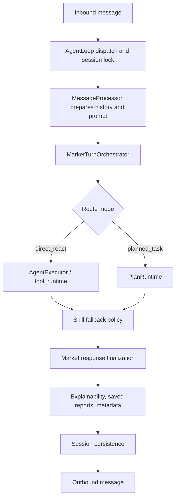

# MarketBot Architecture Refactor

MarketBot is a finance-focused agent. Nano BOT is the general-purpose reference system: it keeps the model/tool runner generic and pushes product behavior into orchestration, hooks, context, and skills. MarketBot should follow the same separation, but with a stronger financial domain layer.

## Target Shape

MarketBot remains CLI-first for this refactor cycle. `marketbot agent` is the primary
interactive product surface, `marketbot gateway` is the long-running delivery surface
for chat channels and scheduled jobs, and no Web dashboard, desktop client, or full TUI
surface is in scope.

## Layer Responsibilities

- `AgentLoop`: transport-facing runtime. It owns bus consumption, per-session locking, stop/cancel behavior, MCP/tool registration, and compatibility methods.
- `MessageProcessor`: turn preparation. It owns slash commands, history windows, memory consolidation scheduling, and prompt construction.
- `MarketTurnOrchestrator`: MarketBot's domain-aware turn kernel. It owns route execution, planned-task dispatch, skill fallback, daily-opportunity normalization, response finalization, metadata, and persistence.
- `AgentExecutor` and `tool_runtime`: generic ReAct/tool execution. These should stay product-agnostic so Nano-style runner improvements can be adopted without mixing in market policy.
- `ContextBuilder` and skills: financial analysis guidance, runtime metadata, market skill routing, and tool-contract loading.
- `marketbot.domain.market`: market capability plugins, source routing, and financial data semantics.

## Product Surface

- `marketbot agent`: primary local CLI interaction for ad hoc financial analysis.
- `marketbot gateway`: channel, cron, heartbeat, and outbound delivery runtime.
- `marketbot status`, `marketbot intel`, `marketbot skills`, and related subcommands: operator/admin surfaces.
- Chat integrations: delivery and conversation endpoints behind the gateway, not separate products.
- Web dashboard, desktop client, and full-screen TUI: explicitly deferred until the CLI product is stable.

## Nano BOT Lessons Applied

- Keep the low-level runner generic and reusable.
- Keep turn lifecycle state explicit instead of scattering it across helper functions.
- Treat runtime context as metadata, with clear boundaries.
- Make tool contracts stable prompt assets, not ad hoc instructions.
- Preserve product-specific policy in a separate orchestration layer.

## MarketBot-Specific Policy

- Live market analysis must prefer fresh market-tool evidence over memory or old chat context.
- Broad opportunity scans should not silently use saved holdings or watchlists.
- Final investment outputs should separate facts, assumptions, confidence, risks, suggested action, and invalidation.
- Provider/API failures are operational details and should stay out of user-facing investment analysis unless debugging is requested.
- Skill fallback and data reliability metadata should remain visible to downstream reporting and chat integrations.

## Next Refactor Targets

- Replace the legacy `_run_agent_loop` body with a Nano-style reusable runner result object.
- Move request policy constants into declarative profiles keyed by route type.
- Add a first-class market evidence bundle so reports can cite which tools produced each fact.
- Introduce typed turn state for active route, selected skills, fallback, data reliability, and report artifacts.
