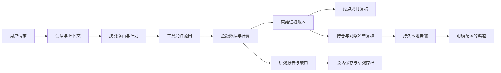

# MarketBot 功能与执行逻辑梳理

审计日期：2026-10-03。定位：个人投资者的跨市场研究、持仓风险与持续跟踪。
本项目参考 Nanobot 的消息循环、渐进式 skills 与 MCP 生命周期设计演进；没有直接替换为 Nanobot 全部代码。
本文件描述当前实现，金融计算正确性、模型判断质量和投资收益分别评估。

## 功能清单

| 层 / 功能 | 当前行为与主要入口 | 条件与边界 |
| --- | --- | --- |
| 初始化 / 配置 | `onboard --refresh` 补金融预设和缺失模板；自定义配置/工作区；`status` 输出运行诊断 | 保留已有 opt-out、自定义 MCP/skills；坏配置不覆盖；诊断不回显密钥 |
| 交互 / Gateway | CLI 单轮与交互聊天；消息总线、渠道接入、会话、长短期记忆与压缩 | 同一 Agent 的完整 turn 串行隔离共享上下文；一轮内可并发安全工具 |
| Router / Planner / Executor / Verifier | 按请求选择 skill/执行计划、限定工具、传递前序证据、重试与技能回退 | 空白名单禁止所有工具；计划阶段保留数值/引用；Verifier 不证明事实或获利 |
| Skills | 63 个内置 skill 目录，覆盖金融、网页、文档及助手任务；声明市场、资产、时效和工具依赖；动态评分 | 模板可加载不等于所有外部依赖可用；技能评分是执行表现，不是投资业绩 |
| 通用工具 | 文件、shell、web、browser/adapter、message、spawn、cron、技能发现/安装等 | 继承配置及允许工具范围；用户请求外发时才配置实际通知；shell 是能力，不是交易账户 |
| 模型提供商 | 18 个 provider 配置入口：Custom/Azure/OpenAI/Anthropic/OpenRouter/DeepSeek/Groq/Zhipu/DashScope/vLLM/Gemini/Moonshot/MiniMax/AiHubMix/SiliconFlow/Volcengine/Codex/Copilot | API key、OAuth 或本地服务各自配置；TLS 失败不再降级；未配置账号的在线路径未验收 |
| 聊天渠道 | Telegram/WhatsApp/Discord/Feishu/Mochat/DingTalk/Email/Slack/QQ/Matrix 的收发、权限名单、状态与解释元数据 | 各平台凭据/运行依赖独立；通用队列目前没有跨平台的远端投递回执 |
| MCP | stdio 与 HTTP 服务、变量解析、启停/allowlist、启动预算、发现分页、故障隔离和清理 | 默认金融 MCP 启用；Alpha Vantage 预设关闭；本地 MCP 与原生工具是相同数据源 |
| 市场数据 | 行情、财务字段、新闻、宏观、事件、社交情绪、筹码、路由与来源健康 | 实际返回时间决定可用性；来源成功不代表实时；缺数据明确披露；启发式分析标明方法 |
| 组合计算 | `portfolio_risk`：Decimal 市值、FX、现金、权重、集中度、币种暴露、明确假设压力情景 | long-only；缺 FX/非法值不输出不完整总值；无历史 Sharpe/相关性/收益预测 |
| 证据账本 | 自动记录原生金融研究与报告；`evidence_record/get/list`；哈希、不可变记录、衍生关系与 claim 引用 | 保存公开 payload；抓取/观察/发布时间独立；拒绝 secret；记录可复现性不保证来源真实性 |
| 投资论点 | `thesis_tracker` CRUD 与 `review`；保留旧 ID/历史、规则、事件证据绑定 | 数值/标的/时间须与原始 evidence/jsonPointer 一致；缺失/过期/估算不能证伪；声明和验证分开 |
| 持仓 / Watchlist | `market_watch` 保存、停用、复核、outbox、ack；价格阈值、最大仓位与时效规则；持仓变化检测 | 首次有效数据建基线；阈值状态转换去重；完整组合与 FX 才估值；本地保存不等于自动交易 |
| 情报库 | `intel` RSS/源配置、采集、SQLite 存储、BM25 回溯、日报与定时任务 | 源和窗口可配置；检索相关性不是事实验证；聚合结果仍需来源阅读 |
| 报告 | `market report` / `market_brief` / Heartbeat：组件 JSON、逻辑链、可靠性、证据记录、Markdown 与通知 | 事件/情绪/信号是启发式；观察时间未知不能用生成时间替代 |
| Cron / Heartbeat | at/every/cron+时区；Heartbeat weekdays/windows；情报任务、研究报告、`finance_watch` 确定性监测 | Gateway 运行时才执行；坏文件保留、原子写入、并发陈旧保存拒绝；尚无交易所假日数据服务 |
| RL / OpenClaw | 启发式策略、rollout JSONL、单资产虚拟环境、风险罚项、数据集与训练适配器、桥接 bundle/脚本及指标 | 模拟和训练基础设施；非有限数/非法仓位拒绝；不代表已训练出有效模型或经验证的 alpha |
| 分发 / 运维 | Python wheel/sdist、Docker/bridge 配置、GitHub Python CI 与安装 smoke | wheel 核验生产源码/skill/模板；Docker/真实平台/训练集群需对应环境单独验证 |

## 18 个原生金融工具

只读 MCP 的 12 个工具为 `market_source_plan`、`market_snapshot`、`market_fundamentals`、
`market_news`、`market_macro`、`market_event_extract`、`market_social_sentiment`、
`market_chip_distribution`、`portfolio_risk`、`evidence_get`、`evidence_list`、`logic_chain_visualizer`。

原生端额外提供 `market_signal`、`market_brief`、`intel_search`、`evidence_record`、
`thesis_tracker`、`market_watch`。这些涉及本地记录/状态修改或数据库初始化，未放入默认只读 MCP。
默认禁用金融工具会关闭金融工具注册与采集；停用 watch 后不会继续请求行情。

## 核心数据流

1. 原始请求驱动技能选择及允许工具集；每个计划步骤收到用户目标和前序实际工具结果。
2. 数据服务按市场分批路由，健康子集保留，未返回和超限标的列出；缓存副本不会被本轮证据 ID 修改。
3. 原生研究结果写入 SQLite evidence store。逐条事实和完整结果分别记录，保留 provider、时间、币种、原始数值及衍生关系。
4. 论点复核只比较已保存规则和账本中的原始字段；传入数值与账本不一致时不转换状态。
5. Watch 的报价/FX 同样核对账本：首次有效输入静默，新的 breach/clear、持仓变化、数据缺口生成稳定 alertId。
6. Cron 直接取报价并复核 watch，无需 LLM 决定是否达到阈值。无变化不发通知；坏数据不推进有效基线。
7. 默认告警进入本地 outbox。明确指定 `--deliver --channel --to` 后才入外发队列；入队不等于远端送达，所以不自动 ack。
   本次 Gateway 运行内去重，重启重投未 ack 告警，属于至少一次投递；接收方可用 alertId 去重，收到后用 `market_watch action=ack` 确认。

## 本轮修复的确认问题

- 混合市场行情漏标的、BRK.B 股份类别截断、报价中非法数字、相对成交量被误当净资金流。
- 新闻缺发布时间时伪造当前时间；行情未保存实际观察时间；旧缓存可被返回对象修改、磁盘非原子写入。
- A 股/港股社交数据及 Reddit 失败时自动捏造 mock；来源别名把 Yahoo 抓取标成 TradingView/yfinance 独立来源。
- CPI 指数误用于百分比阈值及宏观缺指标默认常数（口径依据见 [FRED observations units](https://fred.stlouisfed.org/docs/api/fred/series_observations.html)）。
- 情绪直接证伪论点、中文 ID 碰撞、confidence=0 丢失、损坏 thesis/cron 文件被空状态覆盖。
- 执行器空白名单失效、计划步骤证据断链、完整 turn 共享路由/通知上下文导致跨会话污染。
- 会话文件名碰撞、错误 key 文件加载、OAuth 证书失败降级 TLS、配置/数据源错误回显敏感请求。
- RL 的 NaN/Inf 污染、显式零仓位变满仓、rollout 路径越界和坏数据写入。
- wheel 排除 `rl/env` 源文件、skill/模板资产不完整；CI 调用不存在的 pnpm/移动工程。
- 证据 SQLite 临时日志消失时，多次路径检查误报不安全；改为单次文件状态检查，并复测真实线程/进程竞争。
- Watch 空数据库被重新初始化、目录/数据库链接可写到工作区外；现有坏文件保留，首次完整建库后原子发布。
- CI 原有凭据扫描只生成结果、不阻止新增凭据；改为 hook 门禁，核查并更新仅含测试夹具/公开常量/示例的基线。
- 移除版本控制中的 Python 编译缓存；CI 输出 JUnit 汇总和失败注释，便于无需完整日志权限时定位问题。

## 尚未实现或未经验证

ETF 穿透、行业因子、跨资产相关性、交易所假日服务、按财报公开时间回放、真实模拟账户和收益基准仍是后续建设。
论点定性判断仍需研究者；默认基线价格变化不是交易信号。Tencent 美股原始时间没有可靠时区，保留 sourceTime 且 observedAt 未知，
因此自动严格监测会披露数据缺口；TickFlow/Eastmoney 未识别的源时刻同样不补成抓取时刻。
没有金融数据供应商授权时，不声称延迟报价为实时；没有真实模型/渠道凭据时，不声称在线端到端全部通过。
